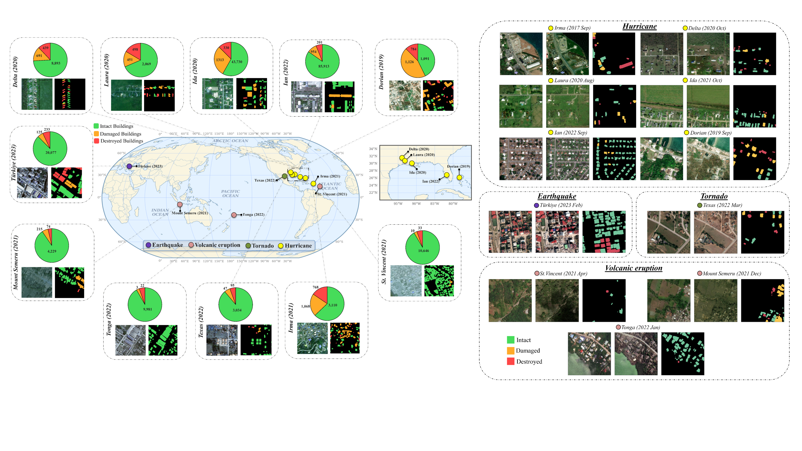
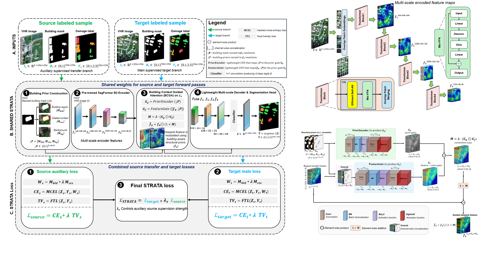
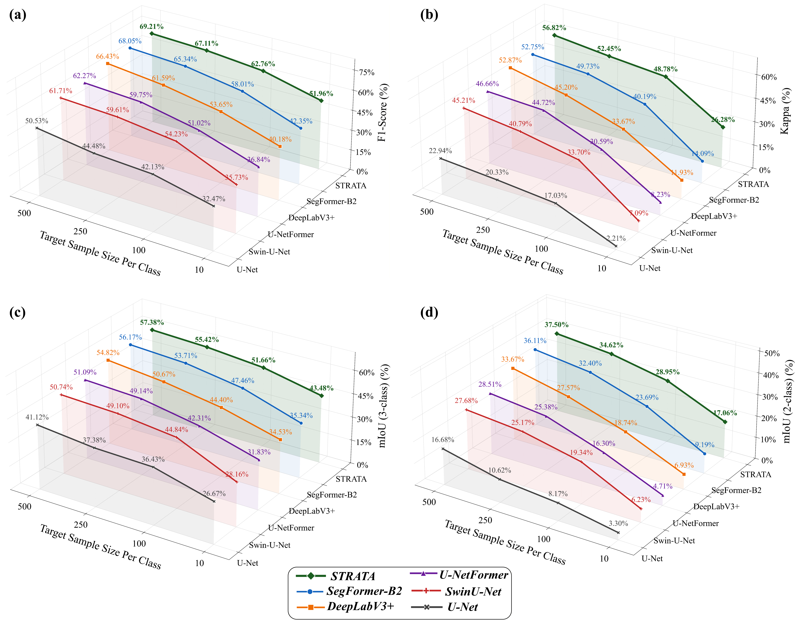

# STRATA: A Structure-Guided Transfer Architecture for Multi-Event Building Damage Assessment from Post-Disaster VHR Optical Imagery under Limited Target Supervision

This repository contains the reference implementation used to train and
evaluate STRATA: a post-event building-damage segmentation framework
designed for settings where only a small number of labeled patches are
available for the disaster event of interest (the "target" event), while
labeled data from other, previously-observed events (the "source"
events) remains plentiful.

STRATA combines:
- a hierarchical SegFormer-B2 encoder,
- learned building-context guidance through Building-Context-Guided
  Attention (BCGA),
- supervised training on labeled source-event data together with a
  limited number of labeled target-event samples,
- multiclass prediction of intact, damaged, and destroyed buildings.

This code was refactored from the research notebook used to produce the
reported results. See [Notes on this reproduction](#notes-on-this-reproduction)
for a full account of what was preserved, what was removed as dead code,
and what remains open for author confirmation.

## Figures

<p align="center">
  
</p>

<p align="center">
  <b>Figure 1.</b> Study events and representative pre-event, post-event, and building-damage annotations from the EBD benchmark.
</p>

<p align="center">
  
</p>

<p align="center">
  <b>Figure 2.</b> Overview of the proposed STRATA architecture.
</p>

<p align="center">
  
</p>

<p align="center">
  <b>Figure 3.</b> Summary of the principal experimental results.
</p>


## Method summary

1. A post-event VHR optical image (three channels) is the model input.
2. A building-footprint prior mask, derived from a pre-event building
   layer, is provided alongside the image.
3. A pretrained **SegFormer-B2** encoder produces four hierarchical
   feature maps (channel widths 64 / 128 / 320 / 512).
4. **BCGA** gates the deepest feature map using a prior built from the
   building mask (building interior / near-building context /
   background), so the decoder is explicitly informed about where
   buildings are before scoring damage classes.
5. A lightweight multi-scale decoder fuses all four encoder stages and
   predicts per-pixel logits at input resolution.
6. Training combines a **source-domain** batch (many labeled events) and
   a **target-domain** batch (few labeled patches from the event of
   interest) each epoch, with the target loss always weighted at 1.0 and
   the source loss ramped in on a schedule (0 &rarr; 0.05 &rarr; 0.10)
   over the first 20 epochs.
7. Output classes: `0=Background, 1=Intact, 2=Damaged, 3=Destroyed`.

## Data

This repository does **not** redistribute the EBD imagery or annotations.

- **EBD dataset**: https://doi.org/10.6084/m9.figshare.25285009

### Label harmonization

The original EBD damage mask uses 5 classes; STRATA harmonizes them into 4:

```text
Original EBD damage_mask:  0=background, 1=no damage, 2=minor damage, 3=major damage, 4=destroyed
Harmonized STRATA labels:  0=Background, 1=Intact,     2=Damaged,                    3=Destroyed
```

`no damage` and `minor damage` are merged into **Intact**; `major damage`
maps to **Damaged**; `destroyed` remains **Destroyed**.

### Expected NPZ structure

Every training/validation/test sample is a single `.npz` file with three
arrays:

| key | shape | dtype | meaning |
|---|---|---|---|
| `image` | `(256, 256, 3)` | `uint8` | post-event VHR optical patch, 0-255 |
| `damage_mask` | `(256, 256)` | `uint8` | harmonized 4-class label (0-3) |
| `building_mask` | `(256, 256)` | `uint8` | binary building footprint (pre-event) |

Filenames follow the pattern `{EVENT-NAME}_{id}_{y}_{x}.npz`, e.g.
`EARTHQUAKE-TURKEY_018187_256_256.npz`, where `(y, x)` is the patch's
top-left offset within its parent tile -- this is how
`scripts/visualize_predictions.py` and the independent-event preparation
script reconstruct 512x512 blocks from four co-located 256x256 patches.

### Directory layout for the main source/target dataset

```text
ebd_npz/
├── EARTHQUAKE-TURKEY_000001_0_0.npz
├── EARTHQUAKE-TURKEY_000001_0_256.npz
├── HURRICANE-IAN_000042_256_0.npz
└── ...
```

All events live in one flat directory. `src/sampling.create_event_based_split`
assigns each file to the **source** or **target** domain by its event
name; the target events used for the reported results are:

```text
EARTHQUAKE-TURKEY, TEXAS-TORNADOES, HURRICANE-DELTA, HURRICANE-IDA
```

(configurable via `target_events` in `configs/base.yaml`). Every other
event present in the directory (e.g. Hurricane Ian, Hurricane Irma,
St. Vincent volcano, Tonga volcano, Mount Semeru eruption, Hurricane
Laura) is treated as source.

**Note:** the notebook this repository was refactored from does not
include the script that built these 256x256 patches from the raw EBD
release for the main source/target events -- it arrives pre-built. Only
the independent-event preparation script (for a held-out test event, see
below) was present, which you can adapt for other events if you need to
rebuild the main dataset yourself; see [Notes on this reproduction](#notes-on-this-reproduction).

### Independent-event test data

`scripts/prepare_independent_event.py` downloads one full EBD event
directly from Figshare, harmonizes its labels, and produces 256x256 NPZ
patches following the same schema above, keeping only 512x512 blocks
whose building footprint contains all three foreground classes
(intact/damaged/destroyed) -- this guarantees every patch can later be
regrouped into a complete, evaluable 512x512 block. The reported
independent-event results use Hurricane Dorian.

## Pretrained encoder

- **SegFormer-B2 checkpoint**: https://huggingface.co/nvidia/segformer-b2-finetuned-ade-512-512
- **Official SegFormer repository**: https://github.com/NVlabs/SegFormer

The encoder was pretrained on ImageNet-1K and subsequently fine-tuned for
semantic segmentation on ADE20K; STRATA uses its hierarchical hidden
states (before the SegFormer decode head) as multi-scale features.

## Installation

```bash
git clone <REPOSITORY_URL>
cd STRATA
pip install -r requirements.txt
```

## Running the experiments

**Deviation from a target-only / joint-training / fine-tuning script
split:** the underlying notebook implements a single training procedure
(joint source + target supervised training, with a ramped source-loss
weight); it does not define separate target-only, joint-training, or
pretrain-then-fine-tune code paths. Experiments differ only by the
**target label budget**. Accordingly, this repository has one training
script, `scripts/train.py`, driven by one config per budget.

```bash
# Prepare an independent test event (optional, only needed for held-out testing)
python scripts/prepare_independent_event.py \
    --event-name HURRICANE-DORIAN \
    --figshare-article-id 25285009 \
    --local-root data/independent_events/HURRICANE-DORIAN

# Train at a given target label budget (10 / 100 / 250 / 500 / all_data)
python scripts/train.py --config configs/budget_n10.yaml
python scripts/train.py --config configs/budget_n100.yaml
python scripts/train.py --config configs/budget_n250.yaml
python scripts/train.py --config configs/budget_n500.yaml
python scripts/train.py --config configs/budget_all_data.yaml

# Validation-event evaluation (same target domain / split seen during training)
python scripts/evaluate_validation_events.py \
    --config configs/budget_n100.yaml \
    --checkpoint runs/main/optical_to_optical/STRATA_O2O_n100/models/best_model.pth

# Independent-event evaluation (a fully held-out disaster event)
python scripts/evaluate_independent_event.py \
    --data-root data/independent_events/HURRICANE-DORIAN/HURRICANE-DORIAN_npz_512valid_as_256 \
    --checkpoint runs/main/optical_to_optical/STRATA_O2O_full_AllData/models/best_model.pth \
    --event-name HURRICANE-DORIAN \
    --out-excel runs/HURRICANE_DORIAN_test_metrics/HURRICANE_DORIAN_test_patch_metrics.xlsx

# Qualitative 512x512 prediction grids (either validation-linked or independent-event)
python scripts/visualize_predictions.py \
    --data-root /path/to/ebd_npz \
    --checkpoint runs/main/optical_to_optical/STRATA_O2O_n250/models/best_model.pth \
    --validation-files-npz splits/ebd_fixed_train_val_split.npz \
    --out-dir runs/visualizations/STRATA_n250

# Optional: descriptive dataset statistics
python scripts/dataset_stats.py --data-root /path/to/ebd_npz
```

### Target-label budgets

The label-budget configs construct their labeled set with
`src.sampling.split_per_class_nested`: for each foreground class (1, 2,
3), up to `target_labels_per_class` files *containing that class
anywhere in their damage mask* are drawn from the target domain's fixed
training split (a file can satisfy more than one class and is only
counted once; duplicate selections across classes are removed via a set
union, so the resulting labeled-set size is not simply
`3 x target_labels_per_class`). Budgets used in the study:

```text
10, 100, 250, and 500 target patches per class
```

plus an `all_data` configuration with no per-class cap (see the caveat in
[Notes on this reproduction](#notes-on-this-reproduction) regarding this
specific configuration).

## Evaluation

Evaluation always excludes background pixels before computing any
metric, and reports:

- Accuracy
- macro Precision
- macro Recall
- macro F1-score
- Cohen's Kappa
- IoU for Intact, Damaged, and Destroyed
- 3-class mIoU
- rare 2-class mIoU (mean of the Damaged and Destroyed IoUs -- this is
  the metric used for checkpoint selection and early stopping during
  training)

Two evaluation modes are distinguished:

- **Validation-event evaluation** (`scripts/evaluate_validation_events.py`):
  the fixed 30% validation split of the *same* target domain used during
  training, broken down per event plus a global row.
- **Independent-event evaluation** (`scripts/evaluate_independent_event.py`):
  a fully held-out disaster event never seen during training or
  validation, evaluated both **pixel-wise** and **building-wise**
  (majority vote per connected building object), with per-patch and
  global rows.

## Outputs

For a training run at `runs/main/optical_to_optical/<run_name>/`:

```text
<run_name>/
├── models/
│   └── best_model.pth                       # best checkpoint by rare 2-class mIoU
├── final_validation_global_metrics.xlsx     # global validation-set metrics at the best checkpoint
└── history_full.pth                          # train/val loss history, per-eval-cycle metrics
```

`scripts/evaluate_validation_events.py` additionally writes
`final_validation_event_based_metrics.xlsx` next to the checkpoint.
`scripts/evaluate_independent_event.py` writes a workbook with sheets
`global_pixel_metrics`, `global_building_metrics`, `patch_pixel_metrics`,
`patch_building_metrics`, `cm_pixel`, `cm_building`.
`scripts/visualize_predictions.py` writes JPEG prediction-grid images.

## Reproducibility

- **Random seed**: `42` (`src/utils.set_seed`, applied to Python/NumPy/PyTorch
  at the start of every run). **This is an addition beyond the original
  notebook** -- the notebook only seeds the *data-split construction*
  (`random.seed(42)` / `np.random.seed(42)` inside the dataloader-building
  step), not model initialization or the training loop itself. See the
  caveat below.
- **Optimizer**: AdamW, initial learning rate `1e-4`.
- **LR scheduler**: CosineAnnealingLR (`T_max=epochs`, `eta_min=1e-6`),
  stepped once per validation cycle.
- **Batch sizes**: source batch `128`; target-labeled batch
  `max(1, 128 // 2) = 64`; gradient accumulation over 2 steps.
- **Max epochs**: 100.
- **Validation frequency**: every 3 epochs (and always on the final epoch).
- **Early-stopping patience**: 5 validation cycles (i.e. 15 epochs) without
  improvement in rare 2-class mIoU.
- **Checkpoint-selection criterion**: best rare 2-class mIoU on the target
  validation split.
- **Encoder initialization**: `nvidia/segformer-b2-finetuned-ade-512-512`
  (ImageNet-1K &rarr; ADE20K pretrained).
- **Source/target batch composition**: one source batch and one
  target-labeled batch per training step (target-labeled loader is
  cycled independently and restarted when exhausted).
- **Hardware assumptions**: a single CUDA GPU; mixed precision (`torch.amp`)
  with gradient scaling. CPU execution is supported but not the intended
  configuration.

## Citation

```bibtex
@article{khankeshizadeh_strata,
  title   = {STRATA: A Structure-Guided Transfer Architecture for Multi-Event Building Damage Assessment from Post-Disaster VHR Optical Imagery under Limited Target Supervision},
  author  = {Khankeshizadeh, Ehsan and Mohammadzadeh, Ali},
  journal = {Science of Remote Sensing},
  year    = {2026},
  note    = {Manuscript under review}
}
```
